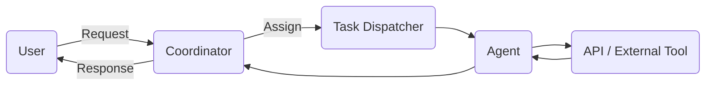

# The Master Control Program

The **Master Control Program (MCP)** is the heart of your agent ecosystem. It acts as an orchestrator, coordinating agent tasks, managing prompt templates, and ensuring consistent state across workflows.  
At its core, MCP provides:

* **Task Scheduling:** Trigger agents on a schedule or in response to events.
* **State Management:** Persist and retrieve agent state across sessions.
* **Tool Invocation:** Delegate tasks to external tools (e.g. web searches, internal APIs) and merge results back into your prompts.

## Architecture

An MCP instance typically consists of:

1. **Coordinator:** The logic that routes tasks and maintains a queue of pending actions.
2. **Agent Registry:** A catalog of available agents and their capabilities (LLM types, tool access, memory size, etc.).
3. **Task Dispatcher:** The component responsible for launching agents with the right prompts, context, and toolset.

### Example Flow

Continue exploring by diving into [GPT‑5 techniques](/docs/gpt5) or exploring [common workflows](/docs/workflows).
